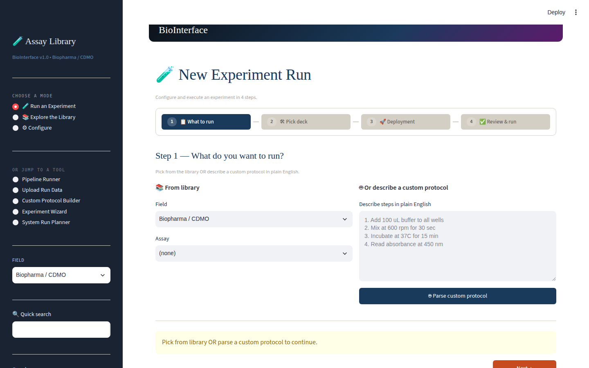
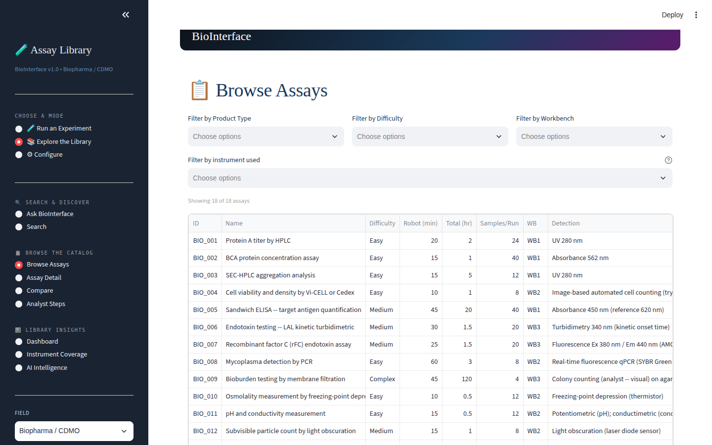
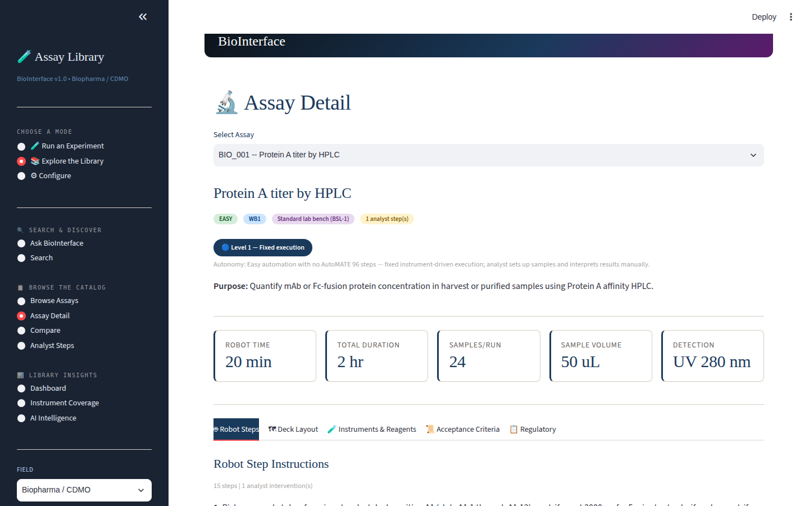
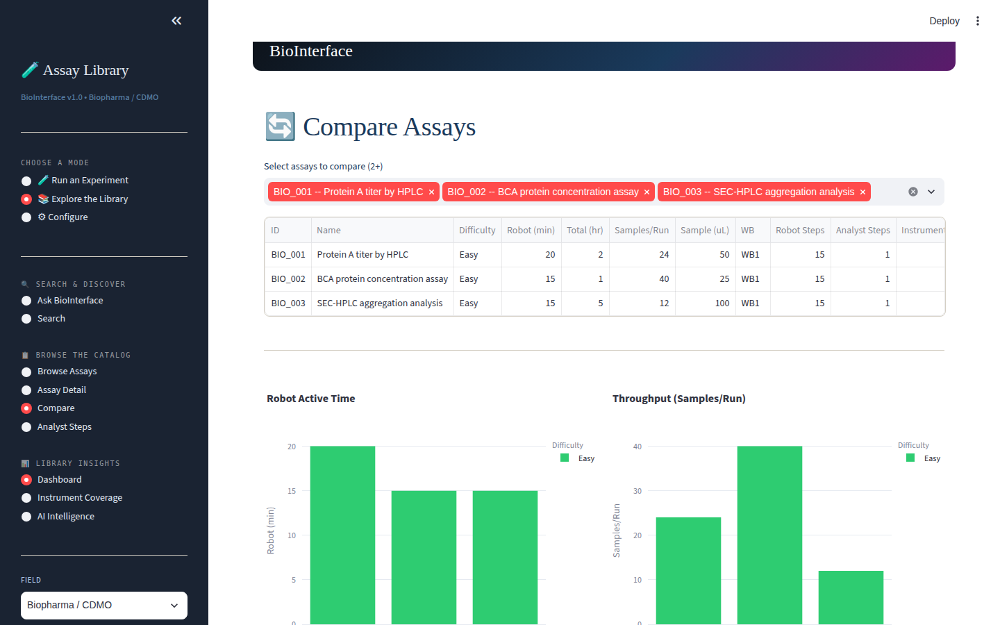
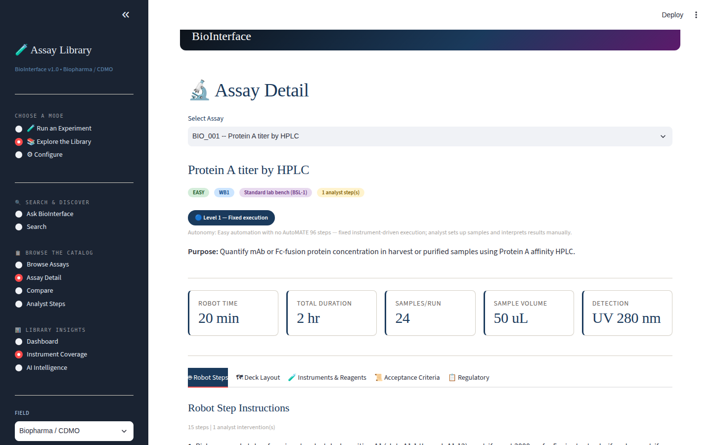
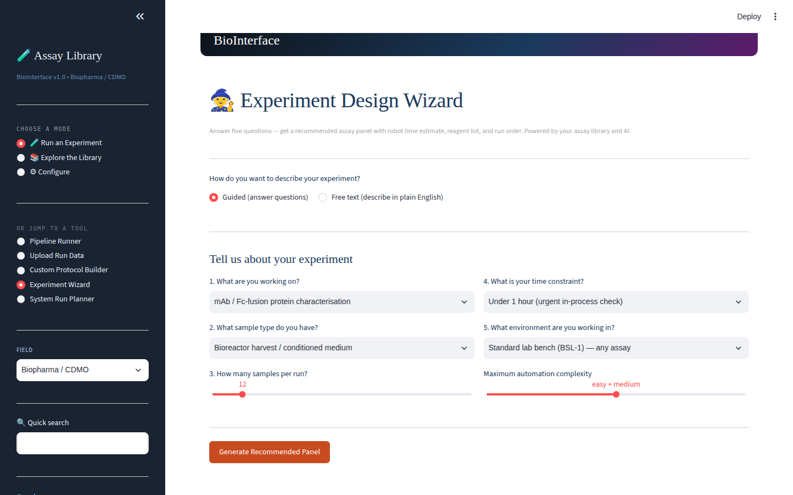

# Robotic Assays

**A machine-executable laboratory assay library and the workbench to plan, run and review automated assays — 58 assays across biopharma QC, core molecular biology, drug-discovery screening and genomics/NGS.**

Every assay is structured data, not prose. Each entry carries: numbered robot step instructions, a deck layout, workbench and instrument assignment, reagents and consumables, sample throughput and volumes, robot time and total duration, analyst interventions, a difficulty grade, an **autonomy level** (an honest label of what a robot can genuinely do today versus what stays manual), structured acceptance criteria, and regulatory references. The Streamlit workbench — **BioInterface** — turns that library into a planning, execution and review tool.

## The library — 58 assays, 4 fields

| Field | Assays | Examples |
|---|---|---|
| Biopharma / CDMO QC (`field_01_biopharma_v2.py`) | 18 | Protein A titer by HPLC, BCA, SEC-HPLC aggregation, Vi-CELL viability, sandwich ELISA, LAL & rFC endotoxin, mycoplasma qPCR, bioburden by membrane filtration, osmolality, pH/conductivity, subvisible particles |
| Core lab methods (`field_05_core_lab_methods.py`) | 20 | The molecular-biology backbone: extractions, quantitation, gels, cloning workflows |
| Drug-discovery HTS (`field_04_drug_discovery_hts_v2.py`) | 12 | Plate-based screening and dose-response workflows |
| Genomics / NGS (`field_03_genomics_ngs.py`) | 8 | Library preparation and QC workflows |

All defined against a structured schema (`assay_schema_v3.py`) with a query API — filter by product type, difficulty, workbench, instrument or autonomy level. Autonomy levels run from *Level 1 — fixed instrument-driven execution* upward, so every method states plainly how automatable it is.

## BioInterface — the workbench

```bash
pip install -r requirements.txt
streamlit run assay_tool.py
```

Three modes, one sidebar:

**🧪 Run an Experiment** — a four-step wizard (*what to run → pick deck → deployment → review & run*). Start from a library assay or paste a protocol in plain English and let the parser structure it. Supporting tools: a visual **Deck Designer**, a **Custom Protocol Builder**, a **Pipeline Runner** for chaining assays, a five-question **Experiment Wizard** that recommends an assay panel with robot-time estimates, and a **System Run Planner**.

**📚 Explore the Library** — browse and filter the catalog; open a full **Assay Detail** dossier with tabs for robot steps, deck layout, instruments & reagents, acceptance criteria and regulatory references; **Compare** assays side-by-side with robot-time and throughput charts; review **Analyst Steps**; check **Instrument Coverage** across the library; **Search** and **Ask BioInterface** for natural-language queries; a **Dashboard** of library insights.

**⚙ Configure** — field selection and workbench setup.

**Upload Run Data** — ingest real instrument output and evaluate it against the assay's acceptance criteria, with root-cause-analysis and QA-escalation flags on failures. Sample files for four instruments ship in the repo: Qubit (`test_qubit*.csv`), Agilent TapeStation (`test_tapestation_*.csv/xlsx`), Tecan Spark (`test_tecan_spark.xlsx`) and BMG CLARIOstar (`test_bmg_clariostar.xlsx`), plus a generic plate reader format.

**AI features (optional)** — with an `ANTHROPIC_API_KEY` in a local `.env` (never committed): *Ask BioInterface* Q&A over the library, and an *AI Intelligence* layer grounded in public ICH/FDA guidance with page-level citations, hallucination gating and confidence calibration (`ai_layer.py`; corpus built with `embed_corpus.py` from public guidance documents — not vendored here). Supabase (`SUPABASE_URL`/`SUPABASE_KEY`) enables saved decks and run history; Voyage (`VOYAGE_API_KEY`) enables semantic search. **Everything else runs fully offline with no keys.**

## Protocol export

`rail_protocol_generator.py` compiles any assay into an execution plan and a **PyLabRobot-style Python module** (hardware-agnostic liquid-handling layer), plus numbered plain-text protocol exports — the bridge from structured assay definition to running code.

## Repository layout

| Path | What it is |
|---|---|
| `field_01/03/04/05_*.py` | The four assay libraries (58 assays as structured data) |
| `assay_schema_v3.py` | Schema and query API |
| `assay_tool.py` | BioInterface — the Streamlit workbench |
| `deck_designer.py` · `pipeline_visualizer.py` | Visual deck layout and pipeline views |
| `rail_protocol_generator.py` | Execution plans, PyLabRobot-style codegen, protocol export |
| `run_data_ingestion.py` + `test_*.csv/xlsx` | Instrument-output parsing and acceptance-criteria evaluation |
| `ai_layer.py` · `embed_corpus.py` | Optional citation-grounded AI layer over public ICH/FDA guidance |
| `protocols/` | Per-assay protocol modules |
| `demo_synbiobeta.py` · `seed_demo_data.py` · `expand_demo_data.py` | Demo and data-seeding scripts |
| `docs/screenshots/` | The screenshots below |

## Screenshots

| | |
|---|---|
|  |  |
|  |  |
|  |  |

## Requirements

Python 3.10+ · streamlit, pandas, plotly. Optional: `anthropic` (AI features), `supabase` (persistence), `voyageai` (semantic search).

## Author

Designed and built independently by **Anupama Kozhiyalam** — industrial biotechnologist with nine years of bench and manufacturing experience across fermentation, analytical development and regulated QC, applied here to the question of what laboratory automation actually needs to know about an assay before it can run one.

[github.com/anupama29k](https://github.com/anupama29k) · MIT License
